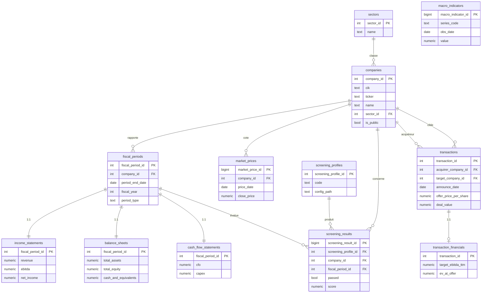
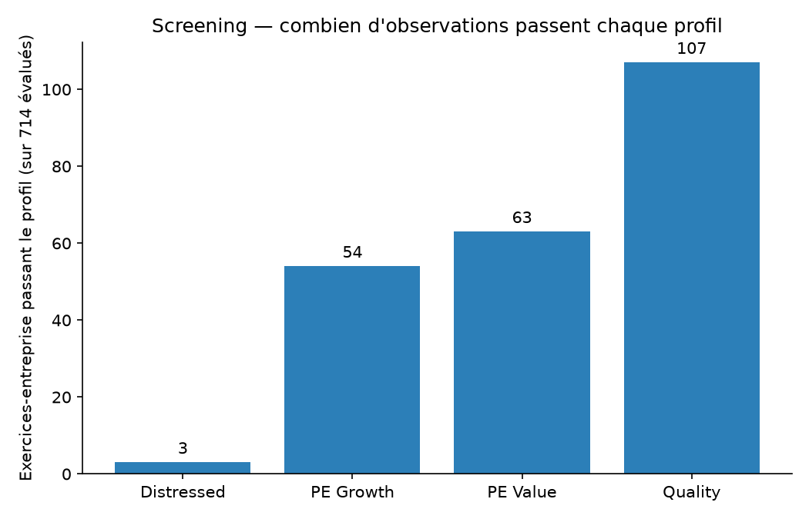
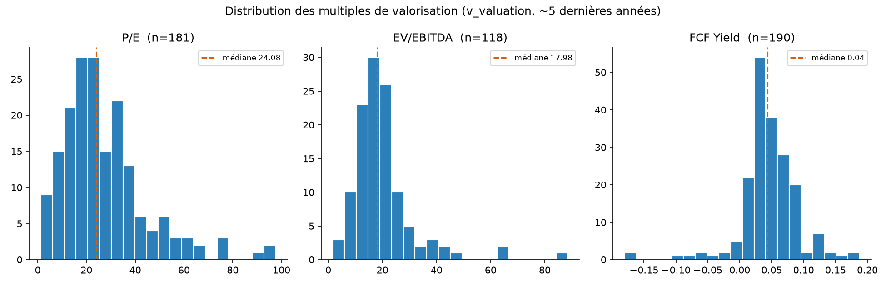
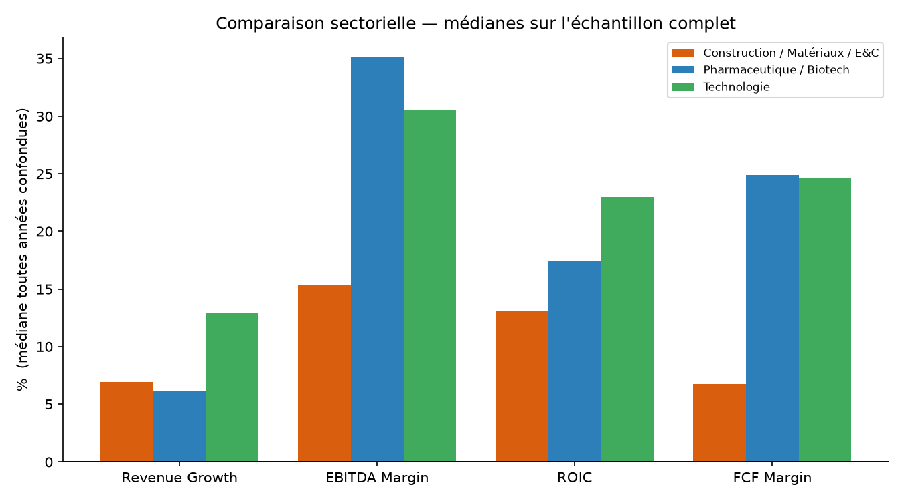
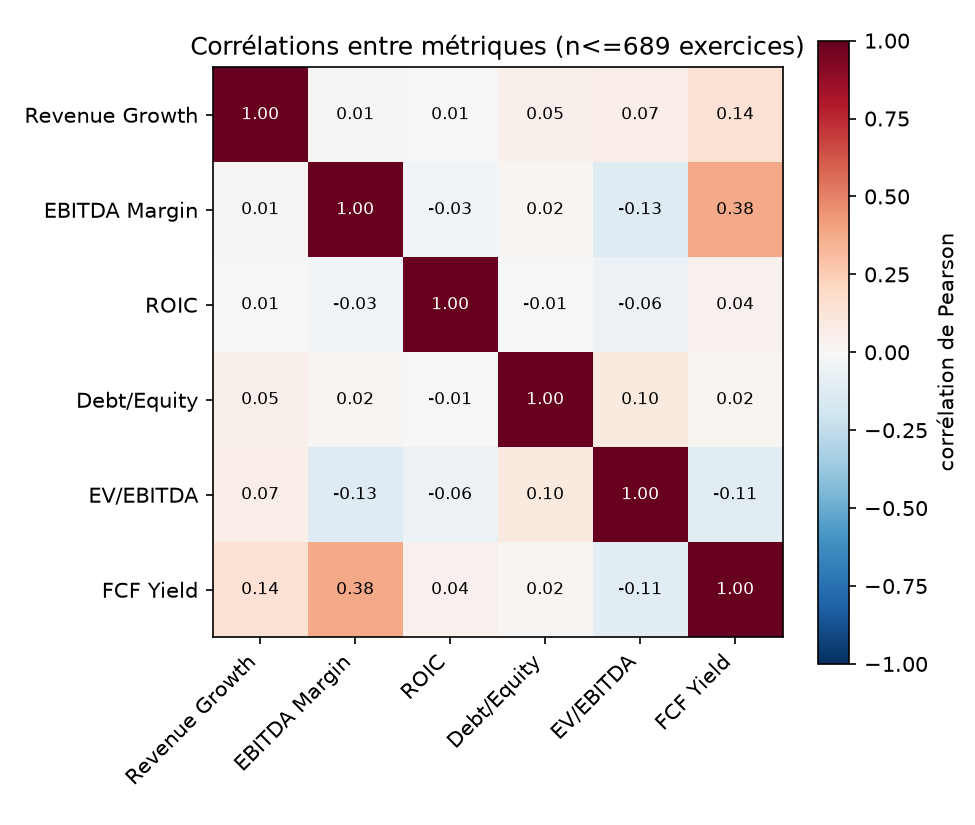

# Financial Intelligence Pipeline

**SEC EDGAR/XBRL → PostgreSQL → screening quantitatif. Projet 1/3 d'un portfolio finance quantitative — SQL / PostgreSQL.**

Un pipeline de données financières et son SQL analytique — 43 entreprises, 3 secteurs, 5 transactions M&A. Détail étape par étape : [`PORTFOLIO_PROGRESS.md`](PORTFOLIO_PROGRESS.md).

## Abstract

Une base PostgreSQL construite sur des données publiques (SEC EDGAR, FRED, Yahoo Finance), pour 43 entreprises US sur 3 secteurs contrastés : pharma, tech, construction. 714 exercices annuels normalisés depuis du XBRL brut dans un schéma à 12 tables, 13 vues SQL (croissance, marges, ROIC, leverage, valorisation, rankings, qualité des données, primes M&A), et un moteur de screening à 4 profils dont les seuils sont en YAML plutôt qu'en dur dans le code.

## Motivation

Montrer du SQL analytique appliqué à un problème financier concret : collecte, normalisation, ratios, screening, de bout en bout.

## Research Question

*Peut-on construire, à partir de données financières publiques, un système capable de classer des entreprises selon des profils d'investissement standards (croissance, valeur, qualité, distressed), tout en rendant explicite la mécanique financière derrière chaque classement ?*

Détail : [`docs/00_project_charter.md`](docs/00_project_charter.md).

## Key Contributions

- Schéma relationnel à 12 tables, modélisation justifiée dans [`docs/01_data_model.md`](docs/01_data_model.md).
- Collecte SEC EDGAR, FRED, Yahoo Finance sur 43 entreprises + 5 transactions M&A sourcées individuellement.
- Normalizer XBRL, 3 bugs de tagging SEC EDGAR corrigés en route — détail dans [`docs/data_sources.md`](docs/data_sources.md) section 6.
- 13 vues SQL : ratios, rankings, primes de transaction, qualité de données.
- Moteur de screening générique, seuils en YAML.
- Une requête optimisée de 332 ms à 0,17 ms via une vue matérialisée (~1950x), plan EXPLAIN ANALYZE à l'appui.
- 4 visualisations générées depuis les vues existantes, voir section Visualizations.
- 54 tests (pytest + SQL sur base éphémère).

## Data

| Source | Contenu | Résultat |
|---|---|---|
| SEC EDGAR (Company Facts API) | États financiers US GAAP | 43/43 entreprises, 182 Mo JSON brut |
| FRED | Taux, spread crédit, Fed Funds | 3/3 séries, 17 792 observations |
| Yahoo Finance (`yfinance`) | Prix de marché, 5 ans | 43/43 tickers, 53 940 lignes |
| Annonces SEC 8-K (manuel) | 5 transactions M&A réelles | Chaque source vérifiée individuellement |

**Échantillon** : 43 entreprises US, 3 secteurs — Pharma/Biotech (14), Tech (15), Construction/Matériaux (14), choisies manuellement.

**Limitations** :
- **M&A** : pas de base de deals propriétaire accessible gratuitement — 5 transactions construites à la main depuis des annonces SEC.
- **Biais de survivance** : les 43 entreprises sont toutes cotées et actives aujourd'hui, aucune faillite/délisting sur la période.
- **Yahoo Finance** sert uniquement aux prix de marché. Pas d'historique de nombre d'actions → `v_valuation` approxime la capitalisation par `close_price × shares_diluted`.
- **Cohérence comptable** : Actif = Passif + Capitaux propres (tolérance 1%) échoue sur 56/461 lignes testables (12,1% — `total_liabilities` ne couvre que 64,6% des 714 lignes). Cas le plus marquant : MRNA 2017, probablement des capitaux propres temporaires pré-IPO non capturés par le schéma.
- Dépôts annuels (10-K) uniquement, pas de détail trimestriel.

Détail complet, URLs, taux de remplissage par champ : [`docs/data_sources.md`](docs/data_sources.md).

## Data Quality

Coverage, identités comptables et outliers, interrogeables via [`v_data_quality_flags`](sql/views/013_v_data_quality_flags.sql) et [`004_data_quality_report.sql`](sql/queries/004_data_quality_report.sql) :

- **Outliers statistiques** (z-score intra-secteur, |z| > 3) : 25/714 lignes flaguées — ex. MRNA croissance +1234% puis +2199% en 2020-2021 (lancement du vaccin COVID), VRTX marges à -573%/-464% en 2009-2010 (avant son premier médicament approuvé).
- **Identité comptable** : 56/461 lignes testables (12,1%) hors tolérance 1% ; `total_liabilities` ne couvre que 64,6% de l'échantillon.
- **Doublons** : 0, confirmé par requête indépendante de la contrainte qui les empêche en base.
- **Restatements** : hors périmètre (choix pris dès la conception du schéma).

Détail : [`docs/data_sources.md`](docs/data_sources.md) section 8.

## Methodology

```
SEC EDGAR / FRED / Yahoo Finance (sources brutes)
        │  fetchers Python (User-Agent SEC déclaré, rate-limité)
        ▼
  data/raw/ (JSON/CSV bruts, jamais modifiés)
        │  normalizers Python (mapping tags XBRL → colonnes, cf. xbrl_concepts.py)
        ▼
  data/processed/ (CSV tabulaires)
        │  loaders idempotents (INSERT ... ON CONFLICT DO UPDATE)
        ▼
  PostgreSQL — 12 tables normalisées
        │  vues SQL (window functions, CTE imbriquées)
        ▼
  13 vues analytiques + 1 vue matérialisée
        │  moteur de screening (seuils YAML, logique Python générique)
        ▼
  screening_results (audit trail : config_hash, run_date)
```

La logique financière (ratios, rankings, primes) vit en SQL ; Python se contente d'ingérer, d'orchestrer et d'appliquer les seuils de screening.

## Database Architecture (ERD)



Pourquoi ce découpage (pas de table `valuations`, `fiscal_periods` séparé, etc.) : [`docs/01_data_model.md`](docs/01_data_model.md). DDL : [`sql/schema/001_init.sql`](sql/schema/001_init.sql).

## SQL Highlights

**1. Croissance, dénominateurs négatifs gérés explicitement** ([`v_growth`](sql/views/001_v_growth.sql)) — `LAG()` compare des exercices vraiment consécutifs (`fiscal_year_prior = fiscal_year - 1`, pas juste "la ligne d'avant"), et un flag `*_prior_negative` signale les cas où la base de comparaison est négative au lieu de sortir un % de croissance trompeur.

```sql
CASE WHEN fiscal_year_prior = fiscal_year - 1 AND revenue_prior > 0
     THEN revenue / revenue_prior - 1 END AS revenue_growth
```

**2. Rankings sectoriels avec `RANK()`/`PERCENT_RANK()`** ([`v_sector_rankings`](sql/views/008_v_sector_rankings.sql)) — classement intra-secteur par exercice, `NULLS LAST` pour qu'une métrique manquante ne fausse jamais un rang, `sector_peer_count` exposé (un rang 2 sur 3 ne veut pas dire la même chose qu'un rang 2 sur 14).

```sql
RANK() OVER (PARTITION BY sector_id, fiscal_year ORDER BY revenue_growth DESC NULLS LAST) AS growth_rank_in_sector
```

**3. Cours de marché le plus proche d'une date** ([`v_valuation`](sql/views/006_v_valuation.sql)) — `DISTINCT ON` pour retrouver, par exercice, le dernier cours disponible à la clôture ou avant (biais de look-ahead sinon).

```sql
SELECT DISTINCT ON (fp.fiscal_period_id) fp.fiscal_period_id, mp.close_price
FROM fiscal_periods fp
JOIN market_prices mp ON mp.company_id = fp.company_id AND mp.price_date <= fp.period_end_date
ORDER BY fp.fiscal_period_id, mp.price_date DESC
```

Le reste des vues (12 au total) est dans `sql/views/*.sql`, commenté.

## Screening Engine

4 profils, seuils en YAML ([`configs/screening/`](configs/screening/)), moteur générique en Python : [`screening_engine.py`](src/financial_intelligence/analytics/screening_engine.py).

**Résultat du dernier run, sur 714 exercices-entreprise :**

| Profil | Passent | Exemples |
|---|---|---|
| PE Growth | 54/714 | NVDA, META, MSFT, GOOGL, AMGN (FY2024-2025) |
| PE Value | 63/714 | GOOGL (2023), CSCO/INTC/ORCL (2021), AAPL/AMGN (2020) |
| Quality | 107/714 | AAPL, MSFT, NVDA, GOOGL, META, ADBE, CSCO, GILD, ORCL |
| Distressed | 3/714 | VTRS (dette élevée post scission Pfizer/Mylan), INTC 2023, VMC 2010 (récession post-2008) |

## Results

- **Rankings sectoriels FY2024 (Tech)** : NVDA #1 en croissance (+125,9%) et marge EBITDA (56,6%) ; TXN dernier (-10,7%, creux du cycle semi-conducteurs).
- **ROIC AAPL** : 42,1% (2020) → 87,4% (2025), repli en 2023 (71,0% contre 73,0%) qui suit un recul du CA cette année-là.
- **Prime M&A recalculée** (Amgen/Horizon Therapeutics) : `116,50 / 78,76 - 1 = 47,92%`, contre 47,9% annoncé par Amgen.
- **Multiples payés** : Seagen 21,9x EV/Revenue, Horizon Therapeutics 8,8x, HashiCorp 11,0x.
- **Corrélation croissance/marge vs multiples** (`sql/queries/001_...sql`, `CORR()` natif Postgres) : quasi nulle à l'échelle globale ; en pharma/biotech, marge et ROIC sont corrélés *négativement* au multiple (-0,70 et -0,40).
- **Profil des cibles M&A vs l'univers** (`sql/queries/002_...sql`) : 2 des 3 cibles mesurables (HashiCorp, Seagen) avaient la marge EBITDA la plus basse de leur secteur au moment de l'annonce.

Détail complet : [`reports/research_report.md`](reports/research_report.md).

## Visualizations

Générées par [`visualize.py`](src/financial_intelligence/analytics/visualize.py) depuis `v_screening_base` et `screening_results`. `make visualize` les régénère.

| | |
|---|---|
|  | **Observations passant chaque profil de screening** — Distressed le plus sélectif (3/714), Quality le plus large (107/714). |
|  | **Distribution de P/E, EV/EBITDA et FCF Yield** — P/E et EV/EBITDA ont une longue queue à droite, la médiane est plus représentative que la moyenne. |
|  | **Médianes par secteur** (ROIC pharma en moyenne brute : -103%, écrasé par un seul point, ABBV 2016 à -8144%) — pharma domine en marge EBITDA, tech en croissance et ROIC. |
|  | **Corrélations entre 6 métriques clés**, tous secteurs confondus — FCF Yield et EBITDA Margin les plus corrélées (0,38). Détail sectoriel : `reports/research_report.md` section 6.5. |

## Query Optimization

| Requête | Avant | Après | Facteur |
|---|---|---|---|
| Historique d'une entreprise (`WHERE ticker = 'AAPL'`) | 332,75 ms | 0,171 ms | **~1950x** |
| Classement sectoriel (`WHERE fiscal_year = 2024`) | 12,25 ms | 0,854 ms | **~14x** |

Le plan EXPLAIN ANALYZE montrait que les fonctions fenêtrées (`LAG`) se recalculaient sur les 714 lignes à chaque requête, avant même que le filtre s'applique. Solution : `mv_company_financial_profile`, une vue matérialisée avec 3 index ciblés, rafraîchie automatiquement après chaque chargement. Détail : [`sql/optimization/README.md`](sql/optimization/README.md).

## Limitations

- Échantillon M&A restreint à 5 transactions.
- Biais de survivance sur les 43 entreprises.
- 56/461 lignes réellement testables (12,1%) hors tolérance sur l'identité comptable Actif = Passif + Capitaux propres.
- Capitalisation boursière approximée, pas de nombre d'actions point-in-time.
- Détail trimestriel non chargé, uniquement les 10-K annuels.
- Le chemin Docker officiel (ci-dessous) n'a pas pu être testé sur la machine de dev faute de Docker Desktop — tout a été vérifié via PostgreSQL portable à la place, voir `PORTFOLIO_PROGRESS.md`.

## Reproducibility

```bash
git clone <repo>
cd financial-intelligence-deal-analytics
docker compose up -d          # lance PostgreSQL 16 (port 5432)
python -m venv .venv && source .venv/bin/activate   # ou .venv\Scripts\activate sous Windows
pip install -r requirements.txt
pip install -e .
cp .env.example .env          # renseigner FRED_API_KEY (gratuit : fred.stlouisfed.org/docs/api/api_key.html)
make schema                   # tables + vues + optimisation, dans le bon ordre
make fetch-data                # SEC EDGAR + FRED + Yahoo Finance (accès réseau requis)
make normalize
make load
python -m financial_intelligence.data.load_ma_transactions
make screen
make visualize
make test
```

Un runner Python équivalent à `make schema` existe pour n'importe quelle instance Postgres atteignable, pas seulement Docker : `python -m financial_intelligence.utils.schema_runner`.

## Installation

Prérequis : Python 3.11+, PostgreSQL 16 (Docker Compose ou toute instance atteignable), une clé API FRED gratuite.

```bash
pip install -r requirements.txt
pip install -e .
```

## Usage

```bash
# Fetch complet (43 entreprises, 3 sources)
python -m financial_intelligence.data.fetch_sec_edgar
python -m financial_intelligence.data.fetch_fred
python -m financial_intelligence.data.fetch_yahoo

# Normaliser puis charger
python -m financial_intelligence.data.normalize_sec_edgar
python -m financial_intelligence.data.normalize_yahoo
python -m financial_intelligence.data.normalize_fred
python -m financial_intelligence.data.load_to_postgres

# Screening (4 profils, seuils dans configs/screening/*.yaml)
python -m financial_intelligence.analytics.screening_engine

# Régénérer les figures (results/figures/*.png)
python -m financial_intelligence.analytics.visualize
```

Interroger les vues directement en SQL, ex. le classement Quality le plus récent :
```sql
SELECT c.ticker, sr.score
FROM screening_results sr
JOIN screening_profiles sp ON sp.screening_profile_id = sr.screening_profile_id
JOIN companies c ON c.company_id = sr.company_id
WHERE sp.code = 'quality' AND sr.passed = TRUE
ORDER BY sr.run_date DESC, sr.score DESC;
```

## Tests

```bash
pytest
```

54/54 passent : tests Python (parsing XBRL, cas limites), tests SQL avec valeurs de référence calculées à la main, tests d'intégrité référentielle (FK/CHECK/UNIQUE), test bout-en-bout du moteur de screening sur des cas synthétiques conçus pour passer/échouer, gestion des NaN/inf dans les visualisations. Base éphémère reconstruite à chaque session. Détail : `tests/`.

## References

- SEC EDGAR — [Company Facts API documentation](https://www.sec.gov/edgar/sec-api-documentation)
- FRED — [Federal Reserve Economic Data API](https://fred.stlouisfed.org/docs/api/fred/)
- `yfinance` — [documentation](https://ranaroussi.github.io/yfinance/)
- Sources et URLs exactes de chaque donnée utilisée : [`docs/data_sources.md`](docs/data_sources.md)
